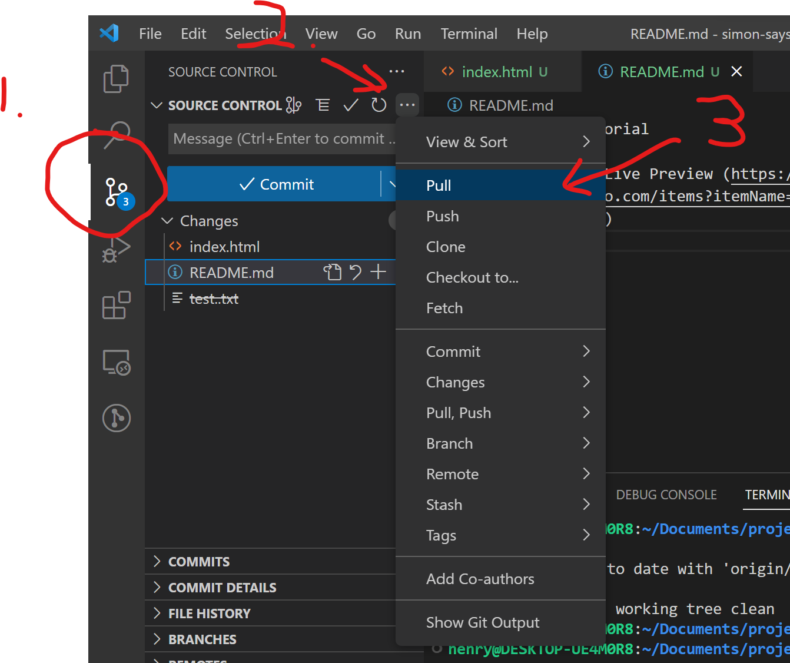
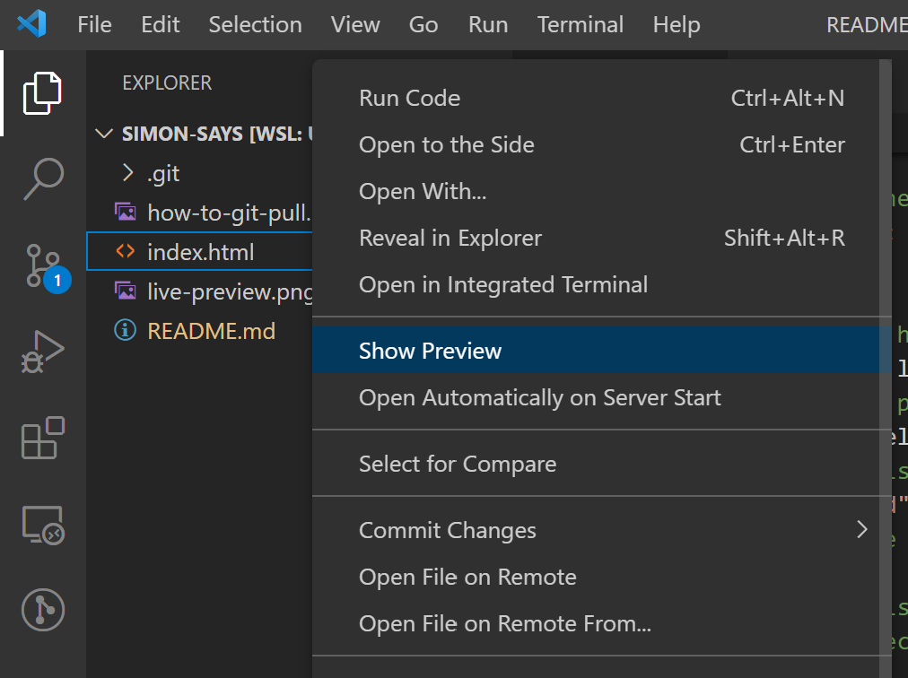
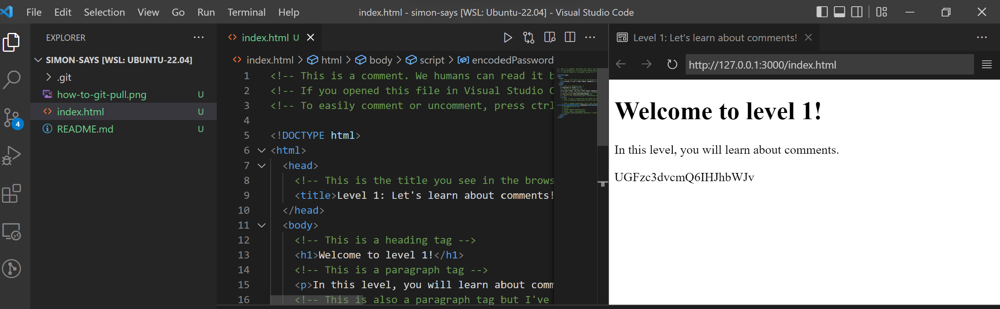

# Level 1 Tutorial

1. Pull/download level 1 by following the image below 
2. Install Live Preview (https://marketplace.visualstudio.com/items?itemName=ms-vscode.live-server)
3. In the file explorer, right click "index.html" and click "show preview" 
3. Now your setup should look like this. The code will be on the left, and a preview of your website on the right. 
4. You're all set up! Good luck and have fun!